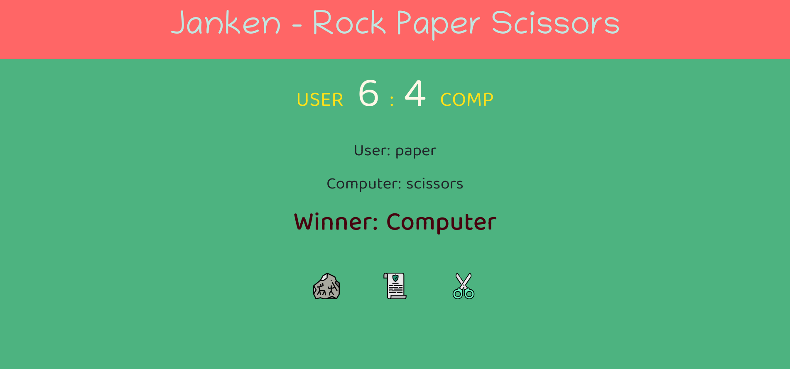

# Projects Using JavaScript

This is a list of projects I made using JavaScript.

## 1. Accordion

- [Project Link](./01Accordion/faq.js) 

---

## 2. Name Conversion

- [Project Link](./02NameConversion/nameConversion.js)

---

## 3. Color Changer

- [Project Link](./03ColorChanger/app.js)

---

## 4. Password Generator

- [Project Link](./04PasswordGenerator/script.js)

---

## 5. Rock Paper Scissors Game

- [Project Link](./05RockPaperScissor/js/main.js)

---

## 6. Joke Generator

- [Project Link](./06JokesGenerator%20-%20API/script.js)

---

## 7. Basic Counter
- [Project Link](./BasicCounter/index.html)

---